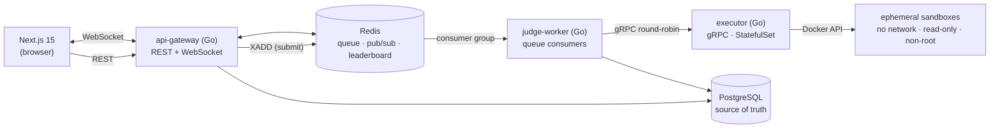

# Arena

[](https://github.com/CamiloRaphaelZuletaWolff/AetherJudge/actions/workflows/ci.yml)
[](https://go.dev)
[](https://nextjs.org)
[](LICENSE)

> A real-time competitive-programming platform: join a contest room, solve
> algorithmic problems in an in-browser editor (C++ / Python / Go), submit,
> get a verdict in seconds, and watch the leaderboard react live across every
> connected client.

The hard engineering problem underneath — and the reason this project exists —
is **safely executing untrusted code at interactive latency**, then fanning
judge results out to every spectator in real time, on infrastructure that
**scales horizontally and recovers from failure** without ever losing a
submission.

---

## Table of contents

- [Highlights](#highlights)
- [Architecture](#architecture)
- [Tech stack](#tech-stack)
- [Quickstart](#quickstart)
- [Running on Kubernetes](#running-on-kubernetes)
- [Observability](#observability)
- [Security](#security)
- [Engineering highlights](#engineering-highlights)
- [Testing & quality](#testing--quality)
- [Repository layout](#repository-layout)
- [Documentation](#documentation)
- [Roadmap](#roadmap)
- [License](#license)

## Highlights

- **Sandboxed multi-language judging.** Untrusted C++/Python/Go runs in
  ephemeral Docker containers with no network, a read-only rootfs, a non-root
  user, dropped capabilities, and memory/CPU/PID/time quotas — force-removed
  after every run. All six verdicts (Accepted, Wrong Answer, TLE, MLE, RE,
  CE) are produced from real resource limits.
- **Durable, horizontally-scalable execution.** Submissions ride a **Redis
  Streams consumer group**: accepted in milliseconds, judged by an
  independently scalable worker tier, at-least-once with idempotent judging,
  crash-recovery via message reclaim, and a PostgreSQL reconciler so a lost
  Redis never loses a submission.
- **Live everything.** Verdicts and leaderboard changes are pushed over
  WebSockets backed by per-room Redis Pub/Sub — open two browsers and both
  update instantly, no refresh.
- **Production shape, end to end.** Kubernetes (Kind) via a Helm umbrella
  chart and Terraform, the executor as a StatefulSet the gateway fans out to
  over gRPC round-robin, Prometheus + OpenTelemetry tracing + Grafana
  dashboards as code, and a k6 load harness.
- **Security as a first-class concern.** A written
  [threat model](docs/security/threat-model.md), defensive response headers,
  a strict sandbox isolation model, and CI supply-chain gates (govulncheck,
  Trivy, gitleaks, Dependabot). See [Security](#security).
- **Built as an artifact.** Phase-by-phase with a hard verification gate
  (compile + tests + lint + local run + docs) between phases, an
  [ADR](docs/adr/) per significant decision, and CI enforcing all of it.

## Architecture



**Two backend services, deliberately.** Everything that shares the relational
domain lives in the **gateway**; the **executor** is isolated because it runs
hostile input. The `judge-worker` is not a third service — it is the gateway's
judging code built as a second entrypoint and deployed as a scalable consumer.
The full reasoning lives in [docs/architecture.md](docs/architecture.md) and
the [ADRs](docs/adr/).

**Data roles are strict.** PostgreSQL is the *only* source of truth; Redis
holds only rebuildable state (the judge queue, pub/sub, the leaderboard sorted
set, rate-limit counters). Losing Redis is recoverable by design.

## Tech stack

| Layer | Technology |
| --- | --- |
| Frontend | Next.js 15 (App Router), React 19, TypeScript (strict), Tailwind CSS v4, Monaco, Zustand, TanStack Query |
| Backend | Go 1.26, gRPC (internal), REST + WebSocket (public), `log/slog` structured logging |
| Contracts | Protobuf compiled with [buf]; generated code committed and drift-checked in CI |
| Data | PostgreSQL 16 (durable truth), Redis 7 (queue, pub/sub, leaderboard, rate limits) |
| Execution | Ephemeral Docker sandboxes, exec-driven pipeline, pre-warmed compile caches |
| Scaling | Redis Streams judge queue, web/worker split, executor StatefulSet + gRPC round-robin, Redis leaderboard cache, k6 load tests |
| Infra | Docker Compose (dev) · Kind + Helm + Terraform (Kubernetes) · Docker-in-Docker judging sidecar |
| Observability | Prometheus, OpenTelemetry tracing (Tempo), Grafana dashboards as code, trace-correlated `slog` |
| Quality | golangci-lint, Vitest + Testing Library, Playwright, GitHub Actions CI |

[buf]: https://buf.build

## Quickstart

**Prerequisites:** Go 1.26+, Node 22+, [pnpm](https://pnpm.io), Docker (Desktop
or Engine), and [go-task](https://taskfile.dev)
(`go install github.com/go-task/task/v3/cmd/task@latest`). Ensure your Go bin
directory (`go env GOPATH`/bin) is on your `PATH`.

```bash
task tools:install        # pinned dev tools (buf, protoc plugins, golangci-lint)
task env:init             # local .env files from examples (generates a JWT secret)
task executor:images      # build the sandbox images for the judge
task infra:up             # PostgreSQL + Redis, waits until healthy
task db:seed              # demo contest + accounts (alice / bob : password123)

task executor:run         # terminal 1 — gRPC server on :9090
task gateway:run          # terminal 2 — HTTP/WebSocket on :8080

cd frontend && pnpm install && pnpm dev    # terminal 3 — http://localhost:3000
```

Open <http://localhost:3000>, sign in as `alice` (`password123`), enter the
**Arena Demo Contest**, and submit a solution — the verdict and leaderboard
update live. Open a second incognito window as `bob` to watch real-time
multiplayer updates.

> The stack runs entirely on dev defaults (no external accounts or
> credentials). `task env:init` materializes the knobs into gitignored
> `.env` files; the services also run with no env files at all.

Run everything CI checks with one command: **`task ci`**.

## Running on Kubernetes

The platform deploys to a local Kubernetes cluster (Kind) via a Helm umbrella
chart — the production shape, including the executor as a StatefulSet with a
per-pod Docker-in-Docker store and the gateway fanning out over gRPC
round-robin.

```bash
task k8s:images && task k8s:up && task k8s:load && task k8s:deploy
task k8s:smoke            # signs up, submits, asserts an `accepted` verdict in-cluster
```

The same release is also expressed as applyable Terraform
(`task tf:init && task tf:apply`). See
[infra/helm/arena/README.md](infra/helm/arena/README.md) and
[ADR-0009](docs/adr/0009-kubernetes-deployment.md).

## Observability

Both services expose Prometheus metrics on dedicated listeners (gateway
`:9100`, executor `:9101`). For the full picture — dashboards and end-to-end
traces — start the observability stack:

```bash
task obs:up               # Prometheus + Tempo + Grafana (Grafana on :53000)
```

Enable tracing by setting `OTEL_EXPORTER_OTLP_ENDPOINT` and restarting the
services; a single submission produces a trace spanning the HTTP request → the
async judge queue (linked spans) → the gRPC call → each sandbox phase, and
every log line inside a span carries its `trace_id`. Three dashboards (API
Overview, Judging Pipeline, Runtime & Infra) ship as code. See
[ADR-0010](docs/adr/0010-observability.md).

## Security

Arena runs attacker-supplied code, so security is treated as a first-class
concern and documented, not assumed. The full STRIDE analysis — assets, trust
boundaries, controls, and accepted residual risks — is in the
[threat model](docs/security/threat-model.md) (ADR-0013); report issues via
[SECURITY.md](SECURITY.md).

- **Sandbox isolation** (the crown jewel): no network, read-only rootfs,
  non-root, `CapDrop: ALL`, `no-new-privileges`, Docker's default seccomp,
  memory/CPU/PID/time quotas, force-removed every run (ADR-0005/0006).
- **Edge & transport:** exact-match CORS allow-list, response security headers
  (`CSP: default-src 'none'`, HSTS, nosniff, frame-deny), `HttpOnly`/`Secure`/
  `SameSite=None` refresh cookies, TLS at the edge.
- **AuthN/Z:** bcrypt, short-lived JWTs, rotated + hashed refresh tokens with
  family revocation (ADR-0007); parameterized SQL; `MaxBytesReader` body caps;
  fail-closed rate limits.
- **Supply chain (CI):** `govulncheck`, `pnpm audit`, Trivy image scans,
  gitleaks secret scanning, and Dependabot across Go, npm, Actions, and Docker.

## Engineering highlights

A few things worth a reviewer's time:

- **The sandbox pipeline** ([`executor/internal/sandbox`](backend/services/executor/internal/sandbox/)):
  exec-driven (no mounts, no `docker cp`), compiles under generous limits then
  `ContainerUpdate`s the same container down to a strict run envelope; images
  carry pre-warmed compile caches. ([ADR-0005](docs/adr/0005-docker-sandbox-strategy.md),
  [ADR-0006](docs/adr/0006-execution-pipeline.md))
- **The durable queue** ([`api-gateway/internal/redisx/queue.go`](backend/services/api-gateway/internal/redisx/queue.go)):
  consumer groups, `XPENDING`/`XCLAIM` reclaim, poison dead-lettering, and a
  PostgreSQL reconciler — idempotent judging makes at-least-once safe.
  ([ADR-0011](docs/adr/0011-queue-and-scaling.md))
- **Auth** ([`api-gateway/internal/auth`](backend/services/api-gateway/internal/auth/)):
  bcrypt, short-lived HS256 access tokens, rotated + hashed refresh tokens
  with family revocation behind an httpOnly cookie, single-flight refresh on
  the client. ([ADR-0007](docs/adr/0007-auth-design.md))
- **The frontend boundary** ([`frontend/src/lib`](frontend/src/lib/)): access
  token in memory only, one silent refresh on reload, a single Zod boundary
  for every REST + WS payload, and WS deltas written straight into the
  TanStack Query cache.

## Testing & quality

- **Go:** table-driven tests with the race detector; golangci-lint (standard
  set + gosec, misspell, revive); gofumpt + goimports formatting.
- **Integration:** Testcontainers suites against real PostgreSQL + Redis
  (idempotent double-delivery, queue reclaim, leaderboard-cache-equals-SQL) and
  executor sandbox suites including malicious submissions and container-leak
  assertions.
- **Frontend:** Vitest + Testing Library; Playwright end-to-end journeys
  (including two-session live updates) drive the full real stack.
- **CI** ([`.github/workflows/ci.yml`](.github/workflows/ci.yml)) runs backend,
  proto-drift, integration, infra, k8s-smoke, e2e, and frontend jobs.

## Repository layout

```
backend/
  go.work                  three-module Go workspace
  proto/                   protobuf contracts (buf)
  pkg/                     shared module: generated pb code, logging, telemetry
  services/api-gateway/    public REST + WebSocket API (+ cmd/worker, cmd/seed)
  services/executor/       sandboxed code execution service
frontend/                  Next.js app (App Router)
infra/docker/              local docker-compose (PostgreSQL, Redis)
infra/k8s/ infra/helm/     Kind config + Helm umbrella chart
infra/terraform/local/     applyable IaC (Kind cluster + Helm release)
loadtest/                  k6 submission load harness
docs/                      architecture overview + ADRs
```

## Documentation

- [Architecture overview](docs/architecture.md) — system design, service
  boundaries, data roles, contracts, scaling, roadmap.
- [Architecture Decision Records](docs/adr/) — the monorepo and Go-workspace
  shape, buf/gRPC contracts, the PostgreSQL/Redis split, the sandbox strategy,
  auth, judging/realtime, Kubernetes, observability, the durable queue, and the
  security posture.
- [Threat model](docs/security/threat-model.md) — STRIDE analysis, controls,
  and accepted residual risks.
- [Deployment guide](docs/deployment.md) — Render + Vercel + executor-on-k8s/VM,
  with the gotchas.
- [DEPLOY.md](DEPLOY.md) — step-by-step free-tier deployment to a live public URL
  (Render + Vercel + AWS EC2), written for first-time users.

## Roadmap

- [x] **Phase 1** — repo foundation: workspace, contracts, chassis services, local infra, CI
- [x] **Phase 2** — secure executor: ephemeral Docker sandboxes, resource quotas, verdicts
- [x] **Phase 3** — core backend: schema/migrations, JWT auth, WebSocket hub over Redis Pub/Sub
- [x] **Phase 4** — frontend: auth, dashboard, split-screen contest room with Monaco
- [x] **Phase 5** — Kubernetes, Helm, Terraform
- [x] **Phase 6** — Prometheus, Grafana, OpenTelemetry tracing
- [x] **Phase 7** — queue-based execution, horizontal scaling, load testing
- [x] **Phase 8** — threat model, security hardening, CI supply-chain gates, portfolio polish

## License

[MIT](LICENSE)
