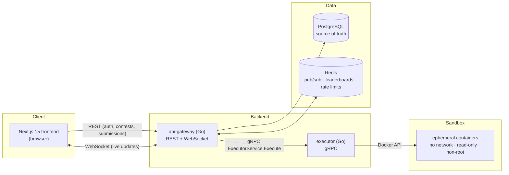

# Arena — Architecture Overview

> Status: Phase 8 complete — all three tracks delivered (Track 1 MVP +
> Track 2 Kubernetes/Helm/Terraform, observability, queue-based execution &
> horizontal scaling + Track 3 security hardening, threat model, and
> supply-chain gates). Post-roadmap: a redesigned Next.js frontend,
> **role-based access control** (`user`/`moderator`/`admin`, enforced
> server-side — ADR-0014), and **in-app admin authoring** of contests,
> problems, and test cases — including **bulk test-case upload** from
> `.txt`/`.md`/`.csv`/`.json`/`.xlsx` files (ADR-0015, ADR-0016). This document describes what exists
> today; the [threat model](security/threat-model.md) covers the security
> posture.

## What Arena is

Arena is a real-time competitive programming platform. Users join contest
rooms, solve algorithmic problems in an in-browser editor (C++, Python, Go),
submit code, receive verdicts within seconds, and watch a live leaderboard
update as other participants submit.

The defining engineering constraint: **the platform executes untrusted user
code**. Every architectural decision flows from treating user submissions as
hostile input.

## System diagram



## Services

The backend is exactly two services. Everything that shares the relational
data model (auth, contests, problems, submissions, leaderboards) lives in the
**api-gateway**; splitting those would create network boundaries inside what
is naturally one transactional domain.

The **executor** is the one justified service split, for three reasons:

1. **Security boundary** — it is the only process that touches untrusted
   code, so it can run with different privileges, on different nodes, and be
   locked down independently.
2. **Resource isolation** — compilation and execution are CPU/memory bursts
   that must not affect API latency.
3. **Independent scaling** — judge throughput scales with contest load on a
   completely different curve than HTTP traffic.

### api-gateway (Go)

The single public entrypoint — REST API v1, WebSocket rooms, and the
gateway side of judging.

| Concern | Approach |
| --- | --- |
| Public API | REST (JSON): auth, contests, problems, submissions, ad-hoc `/run` |
| Auth | 15-min HS256 JWTs + rotated opaque refresh tokens (httpOnly cookie, reuse detection revokes the family), bcrypt-12 ([ADR-0007](adr/0007-auth-design.md)) |
| Persistence | PostgreSQL via pgx + handwritten SQL; goose migrations embedded and applied at startup under a session lock |
| Judging | Bounded in-process worker pool → executor gRPC per test case → ICPC-lite scoring in one transaction; crash recovery via startup requeue ([ADR-0008](adr/0008-judging-and-realtime.md)) |
| Live updates | WebSocket hub; one Redis Pub/Sub subscription per room per replica; slow clients dropped, REST snapshot on join |
| Abuse control | Redis fixed-window rate limits (per-IP on auth, per-user on submissions/runs), fail-closed; body-size caps; strict DTO validation |
| Probes | `/healthz` liveness; `/readyz` verifies PostgreSQL + Redis |

### executor (Go)

Compiles and runs untrusted submissions inside ephemeral Docker containers
and judges them (`ACCEPTED`, `WRONG_ANSWER`, `RUNTIME_ERROR`,
`COMPILATION_ERROR`, `TIME_LIMIT_EXCEEDED`, `MEMORY_LIMIT_EXCEEDED`).

Sandbox invariants — enforced per container and proven by integration tests
(including malicious submissions: network exfiltration, fork bombs,
filesystem writes, privilege escalation, output floods):

- no network access (`NetworkMode: none`)
- read-only root filesystem, no host mounts — code and I/O travel over the
  Docker API via `exec` stdin/stdout only
- non-root user, all capabilities dropped, `no-new-privileges`
- hard quotas: memory (swap off), CPU, wall-clock timeout, pids limit,
  output capture caps
- container force-destroyed after every execution (tests assert zero leaks)

The pipeline compiles under a generous budget, then `ContainerUpdate`s the
same container down to the strict run envelope (128 MB / 0.5 CPU / 2 s
default) before user code runs — naive uniform limits would OOM `g++` on
realistic C++ submissions. Details and measurements in
[ADR-0006](adr/0006-execution-pipeline.md).

### Frontend (Next.js 15)

Client-rendered app surface (the room is live and authenticated; SSR buys
nothing there). Server state via TanStack Query; client state via Zustand
(auth identity in memory, editor drafts persisted per problem×language).
Access tokens are never stored — reloads recover the session via one silent
refresh against the httpOnly cookie, and the API client runs a single-flight
refresh so concurrent 401s can't trip rotation reuse-detection. Every API
response and WS event is Zod-parsed at the boundary. Monaco loads only in
the room. Playwright drives the full real stack as the acceptance suite.

## Contracts

The gateway and executor communicate over gRPC. The contract lives in
[`backend/proto/executor/v1/executor.proto`](../backend/proto/executor/v1/executor.proto)
and is compiled with [buf](https://buf.build) into the shared Go module
`backend/pkg/pb` (generated code is committed; CI fails if it drifts from the
`.proto` source).

The request/response shape is deliberately queue-friendly: submissions ride
a **Redis Streams queue** (Phase 7) consumed by judge workers that call
`Execute` per test case — the executor's core never changed.

## Scaling (Phase 7)

Judging is decoupled and horizontally scalable (decisions:
[ADR-0011](adr/0011-queue-and-scaling.md),
[ADR-0012](adr/0012-leaderboard-read-path.md)):

- **Durable queue.** Submitting `XADD`s to a Redis Stream and returns 202 in
  milliseconds; a consumer group of judge workers pulls, judges, and acks.
  Delivery is at-least-once (judging is idempotent), a crashed worker's
  in-flight messages are reclaimed, and a flushed Redis is reconciled from
  PostgreSQL — the stream is rebuildable, never a source of truth.
- **Web/worker split.** The HTTP gateway and a dedicated `judge-worker`
  deployment scale independently (same image, `cmd/worker` entrypoint);
  single-process local dev still works (the gateway can run consumers).
- **Executor fan-out.** The executor is a StatefulSet (per-pod DinD store)
  behind a headless Service; the gateway/worker round-robin `Execute` across
  replicas. Throughput scales as *workers × executor replicas ×
  MaxConcurrent*; an optional CPU HPA (default off) automates it.
- **Leaderboard read cache.** Standings serve from a Redis sorted set with a
  SQL fallback that warms the cache.

The behavior and scaling curve are measured locally with the k6 harness in
[`loadtest/`](../loadtest/); the queue decouples accept latency (ms) from
judge latency (seconds), and `Execute` fans out evenly across executor
replicas — see [ADR-0011](adr/0011-queue-and-scaling.md) for the results.

## Data roles

**PostgreSQL is the only source of truth.** Users, contests, problems,
submissions, and final standings live here, with migrations, foreign keys and
constraints (Phase 3).

**Redis is ephemeral infrastructure.** Pub/Sub for WebSocket fan-out, sorted
sets for live leaderboard ranking, counters for rate limiting. The rule that
keeps the design honest: *losing Redis must never lose data* — anything in
Redis can be rebuilt from PostgreSQL. Local Redis therefore runs with
persistence disabled. See [ADR-0004](adr/0004-postgres-redis-roles.md).

## Observability

Both services expose Prometheus metrics on dedicated internal listeners
(gateway `:9100`, executor `:9101`) — RED metrics per mux route, judge
queue/duration/verdict counters, sandbox phase histograms, pool stats, and
security signals (refresh-token reuse). OpenTelemetry tracing is fail-soft
(off unless `OTEL_EXPORTER_OTLP_ENDPOINT` is set): one trace follows a
submission HTTP → judge worker (span **link** across the async queue) →
gRPC → each sandbox phase, and every log line written inside a span carries
its `trace_id`. Dashboards, alert rules and provisioning live as code in
`infra/helm/arena/files/observability/`, consumed by both the compose stack
(`task obs:up`, Grafana at `localhost:53000`) and the values-gated
in-cluster stack (`observability.enabled=true`). Decisions and tradeoffs:
[ADR-0010](adr/0010-observability.md).

## Deployment

Two deployment shapes, both verified continuously:

- **Local dev (fast path):** PostgreSQL/Redis in Compose, services native
  (`task gateway:run` / `executor:run`), frontend via `pnpm dev`.
- **Kubernetes (production shape):** one Helm chart deploys all four
  components to Kind; the executor hosts its own Docker daemon as a
  privileged *native sidecar* confined to that single pod — judging works
  identically because the daemon endpoint was always configuration
  ([ADR-0009](adr/0009-kubernetes-deployment.md)). Terraform provisions the
  cluster + release from nothing. CI deploys the chart into a fresh Kind
  cluster on every push and requires a submission to be judged `accepted`
  inside it.

## Repository layout

```
backend/
  go.work                  Go workspace tying the modules below together
  proto/                   protobuf contracts (buf module)
  pkg/                     shared Go module: generated pb code, logging
  services/api-gateway/    public REST + WebSocket service
  services/executor/       sandboxed code execution service
frontend/                  Next.js 15 (App Router), TypeScript strict, Tailwind v4
infra/
  docker/                  docker-compose for local PostgreSQL + Redis
  k8s/                     Kind cluster config (NodePort → host 8091)
  helm/arena/              umbrella chart: gateway, executor+DinD, postgres, redis
  terraform/local/         applyable IaC: Kind cluster + Helm release
docs/
  adr/                     architecture decision records
  phases/                  per-phase architecture proposals
```

Each Go service is its own module (see
[ADR-0002](adr/0002-go-workspace-multi-module.md)); `go.work` makes them feel
like one codebase during development.

## Security

Because Arena executes attacker-supplied code, the security model is explicit
(Phase 8). The trust boundary that matters most is executor → sandbox: hostile
code runs with no network, a read-only rootfs, dropped capabilities,
`no-new-privileges`, Docker's default seccomp, and memory/CPU/PID/time quotas,
in a container force-removed after every run (ADR-0005/0006). At the edge the
gateway enforces an exact-match CORS allow-list, response security headers
(`CSP: default-src 'none'`, HSTS, nosniff, frame-deny), `SameSite=None; Secure`
session cookies, fail-closed rate limits, and `MaxBytesReader` body caps. CI
adds supply-chain gates (govulncheck, Trivy, gitleaks, Dependabot). The full
analysis, including accepted residual risks, is in the
[threat model](security/threat-model.md) and ADR-0013.

## Roadmap

| Track | Phase | Scope | Status |
| --- | --- | --- | --- |
| 1 — MVP | 1 | Repo foundation, local infra, CI | ✅ done |
| 1 — MVP | 2 | Secure executor (Docker sandboxes, verdicts) | ✅ done |
| 1 — MVP | 3 | Core backend: schema, auth, WebSocket hub | ✅ done |
| 1 — MVP | 4 | Frontend: auth, dashboard, contest room | ✅ done |
| 2 — Production | 5 | Kubernetes, Helm, Terraform | ✅ done |
| 2 — Production | 6 | Prometheus, Grafana, OpenTelemetry | ✅ done |
| 2 — Production | 7 | Queue-based execution, load testing, benchmarks | ✅ done |
| 3 — Maturity | 8 | Threat model, security hardening, CI supply-chain gates | ✅ done |
